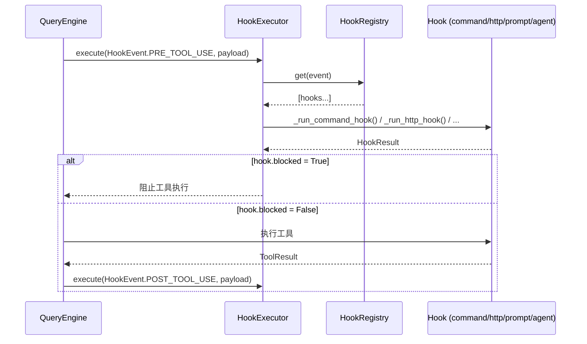
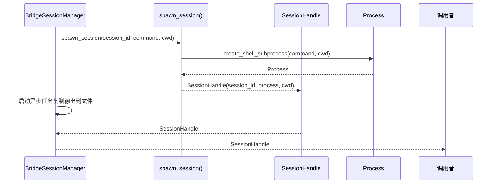
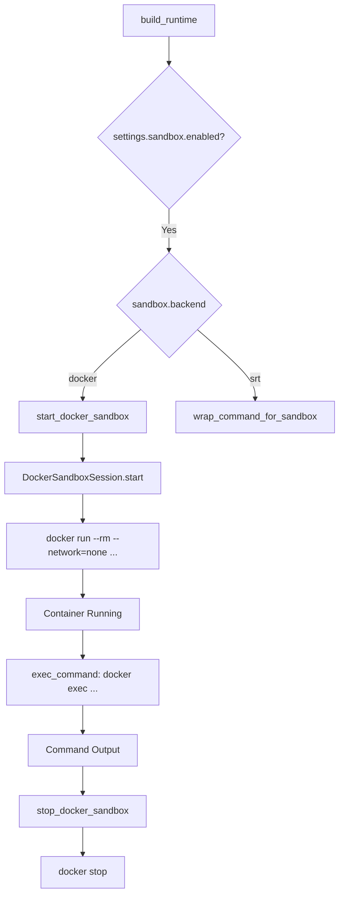
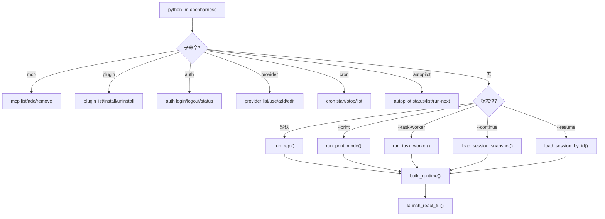
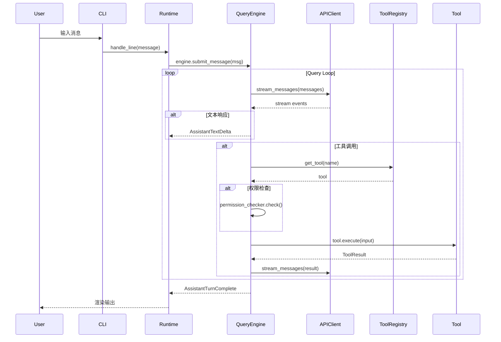
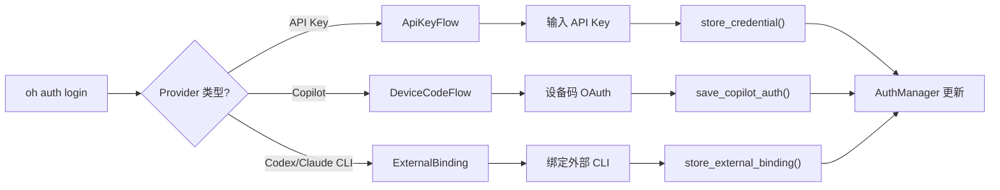
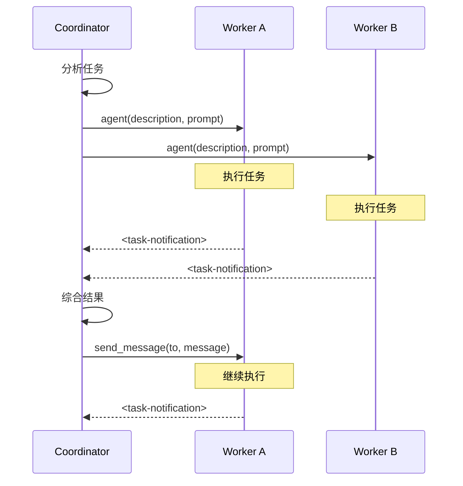
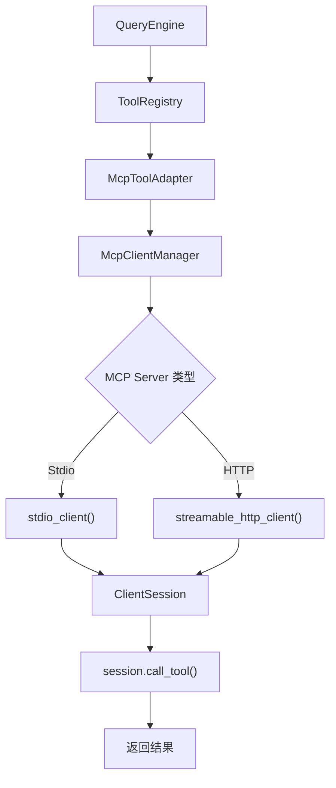

# OpenHarness 架构文档

## 1. 概述

OpenHarness 是一个开源的 AI 编程助手 CLI 工具，基于 Apache 2.0 许可证开源。它是 Claude Code 的开源实现，提供了交互式编程辅助能力。

### 1.1 Harness 的真正含义

**Harness** (挽具/马具) 的隐喻：

- **控制与引导**：如同马具控制马匹一样，OpenHarness 旨在控制和引导 AI 模型完成编程任务
- **连接与驱动**：将用户与各种 LLM Provider 连接起来，驱动 AI 执行各种编程操作
- **安全约束**：像马具限制马的活动范围一样，OpenHarness 提供了权限系统、沙箱环境等安全机制
- **多工具协同**：像马具将马的力气传导到车辆一样，OpenHarness 将 AI 的能力通过工具系统传导到实际编程工作中

在代码中的体现：

1. **Provider Harness**：通过统一抽象连接多种 LLM 提供商（Anthropic、OpenAI、Copilot 等）
2. **Tool Harness**：通过工具注册表将 AI 的能力转化为具体操作（文件读写、Bash 命令等）
3. **Permission Harness**：通过权限系统控制 AI 可以执行的操作
4. **Sandbox Harness**：通过沙箱环境隔离危险操作

## 2. 模块架构总览

```
openharness/
├── cli.py                    # CLI 入口，Typer 命令行框架
├── platforms.py             # 平台检测 (macos/linux/windows/wsl)
├── __main__.py              # 模块入口点
│
├── api/                     # LLM API 客户端层
│   ├── client.py            # 通用流式消息接口
│   ├── anthropic_client.py # Anthropic SDK 客户端
│   ├── openai_client.py    # OpenAI 兼容客户端
│   ├── copilot_client.py   # GitHub Copilot 客户端
│   ├── codex_client.py     # OpenAI Codex 客户端
│   ├── registry.py          # Provider 注册表与自动检测
│   ├── provider.py          # Provider 检测逻辑
│   └── errors.py            # API 错误定义
│
├── auth/                    # 认证管理
│   ├── manager.py           # 统一认证管理器
│   ├── storage.py           # 凭证存储
│   ├── flows.py             # 认证流程 (API Key, Device Code)
│   └── external.py          # 外部 CLI 绑定 (Claude CLI, Codex CLI)
│
├── config/                  # 配置系统
│   ├── settings.py          # 设置模型与配置解析
│   ├── schema.py            # 配置 schema
│   └── paths.py             # 路径工具函数
│
├── engine/                  # 核心引擎
│   ├── query_engine.py      # 查询引擎，管理对话历史和模型循环
│   ├── query.py             # 查询执行逻辑
│   ├── messages.py          # 消息类型定义
│   ├── cost_tracker.py      # 使用量追踪
│   └── stream_events.py     # 流式事件定义
│
├── tools/                   # 工具系统
│   ├── base.py              # 工具基类与注册表
│   ├── bash_tool.py         # Bash 执行工具
│   ├── file_read_tool.py    # 文件读取工具
│   ├── file_write_tool.py   # 文件写入工具
│   ├── file_edit_tool.py    # 文件编辑工具
│   ├── agent_tool.py        # Agent 工具 (启动子 agent)
│   ├── task_*.py            # 任务管理工具集
│   └── ...                  # 其他内置工具
│
├── ui/                      # 用户界面
│   ├── app.py               # REPL 和打印模式入口
│   ├── textual_app.py       # Textual TUI 应用
│   ├── backend_host.py      # React TUI 后端主机
│   ├── runtime.py           # 运行时构建与处理
│   └── ...
│
├── bridge/                  # 多 agent 通信桥接
│   ├── manager.py           # 桥接会话管理器
│   ├── session_runner.py    # 会话运行器
│   └── types.py             # 桥接类型定义
│
├── coordinator/             # 协调器模式
│   ├── coordinator_mode.py  # 协调器模式逻辑与系统提示
│   └── agent_definitions.py # Agent 定义
│
├── hooks/                   # 钩子系统
│   ├── executor.py          # 钩子执行器
│   ├── loader.py            # 钩子加载器
│   ├── events.py            # 钩子事件定义
│   └── types.py             # 钩子类型
│
├── mcp/                     # MCP 客户端
│   ├── client.py            # MCP 客户端管理器
│   └── config.py            # MCP 配置加载
│
├── memory/                  # 记忆系统
│   ├── manager.py           # 记忆管理器
│   └── ...
│
├── plugins/                 # 插件系统
│   ├── loader.py            # 插件加载器
│   ├── installer.py         # 插件安装器
│   └── ...
│
├── prompts/                 # 提示词系统
│   ├── system_prompt.py     # 系统提示词构建
│   └── environment.py       # 环境信息
│
├── services/                # 服务层
│   ├── session_storage.py   # 会话持久化
│   ├── session_backend.py   # 会话后端接口
│   ├── cron.py              # Cron 任务管理
│   └── cron_scheduler.py    # Cron 调度器守护进程
│
├── autopilot/               # 自动驾驶
│   ├── service.py           # RepoAutopilotStore
│   └── types.py             # 任务卡类型
│
├── channels/                # 通知渠道
│   └── impl/                # 渠道实现
│       ├── slack.py
│       ├── dingtalk.py
│       ├── feishu.py
│       └── ...
│
├── state/                   # 应用状态
│   ├── store.py             # 状态存储
│   └── app_state.py         # AppState 定义
│
├── sandbox/                 # 沙箱环境
│   ├── session.py           # Docker 沙箱会话
│   └── docker_backend.py    # Docker 后端
│
└── [其他模块]
    ├── keybindings/         # 键盘绑定
    ├── personalization/      # 个性化
    ├── permissions/          # 权限检查
    └── output_styles/        # 输出样式
```

## 3. 核心模块详解

### 3.1 CLI 层 (`cli.py`)

CLI 是用户与 OpenHarness 交互的入口点，使用 Typer 框架构建。

**主要子命令**：
- `mcp` - MCP 服务器管理
- `plugin` - 插件管理
- `auth` - 认证管理（login/logout/status/switch）
- `provider` - Provider Profile 管理
- `cron` - Cron 调度器管理
- `autopilot` - 自动驾驶任务管理

**主入口逻辑**：
1. 解析命令行参数
2. 处理 `--continue`/`--resume` 恢复会话
3. 处理 `--print` 非交互模式
4. 处理 `--task-worker` 头less worker 模式
5. 否则启动交互式 REPL

### 3.2 API 层 (`api/`)

API 层是连接各种 LLM 提供商的抽象层。

**核心接口**：
```python
class SupportsStreamingMessages(Protocol):
    async def stream_messages(self, messages, ...) -> AsyncIterator[MessageStreamEvent]: ...
```

**支持的 Provider**：

| Provider | Backend Type | 特点 |
|----------|-------------|------|
| Anthropic | `anthropic` | 原生 SDK，支持 claude-* 模型 |
| OpenAI | `openai_compat` | 支持 GPT 系列 |
| GitHub Copilot | `copilot` | OAuth 流程 |
| OpenAI Codex | `codex` | Codex CLI 订阅 |
| DashScope | `openai_compat` | 阿里云 Qwen |
| Moonshot | `openai_compat` | Kimi |
| MiniMax | `openai_compat` | MiniMax |
| Gemini | `openai_compat` | Google Gemini |
| DeepSeek | `openai_compat` | DeepSeek |
| Ollama/vLLM | `openai_compat` | 本地部署 |
| OpenRouter | `openai_compat` | 网关 |
| Bedrock | `openai_compat` | AWS Bedrock |
| Vertex | `openai_compat` | Google Vertex AI |

**Provider 检测流程**：
1. 通过 API Key 前缀检测（如 `sk-or-` → OpenRouter）
2. 通过 Base URL 关键词检测
3. 通过模型名关键词检测

### 3.3 认证层 (`auth/`)

```
┌─────────────────────────────────────────────┐
│              AuthManager                    │
│  - get_active_provider()                    │
│  - list_profiles()                          │
│  - get_profile_statuses()                   │
│  - store_credential()                       │
│  - use_profile()                            │
└─────────────────┬───────────────────────────┘
                  │
    ┌─────────────┼─────────────┐
    ▼             ▼             ▼
┌───────┐   ┌─────────┐   ┌──────────┐
│env vars│  │storage.py│  │external.py│
│ API Key│  │文件存储  │  │外部CLI绑定│
└───────┘   └─────────┘   └──────────┘
```

**认证流程类型**：
1. **ApiKeyFlow** - 直接输入 API Key
2. **DeviceCodeFlow** - OAuth 设备码流程（Copilot）
3. **ExternalBinding** - 绑定到本地 Claude/Codex CLI

### 3.4 配置层 (`config/`)

**Settings 模型**包含：
- `active_profile` - 当前激活的 provider profile
- `profiles` - 多个 provider profile 配置
- `permission` - 权限模式配置
- `theme` - UI 主题
- `sandbox` - 沙箱配置
- `mcp_servers` - MCP 服务器配置

**ProviderProfile**包含：
- `provider` - 提供商名称
- `api_format` - API 格式 (anthropic/openai/copilot)
- `auth_source` - 认证源
- `base_url` - API 端点
- `default_model` / `last_model` - 模型配置
- `allowed_models` - 允许的模型列表
- `context_window_tokens` - 上下文窗口大小

### 3.5 引擎层 (`engine/`)

```
┌──────────────────────────────────────────────────────────────┐
│                        QueryEngine                           │
│  - 管理对话历史 (_messages)                                    │
│  - 管理工具注册表 (_tool_registry)                             │
│  - 管理权限检查器 (_permission_checker)                       │
│  - 追踪使用量 (_cost_tracker)                                 │
│                                                              │
│  submit_message(prompt) → AsyncIterator[StreamEvent]          │
│  continue_pending() → AsyncIterator[StreamEvent]             │
└─────────────────────────┬────────────────────────────────────┘
                          │
                          ▼
┌──────────────────────────────────────────────────────────────┐
│                         run_query()                          │
│  - 构建 QueryContext                                         │
│  - 调用 API 流式接口                                         │
│  - 执行工具循环                                              │
│  - 处理权限检查                                               │
│  - 执行钩子                                                   │
└─────────────────────────┬────────────────────────────────────┘
                          │
                          ▼
┌──────────────────────────────────────────────────────────────┐
│                      Tool Execution                          │
│  - BashTool / FileReadTool / FileEditTool / ...              │
│  - AgentTool (启动子 agent)                                   │
│  - McpToolAdapter (MCP 工具适配器)                            │
└──────────────────────────────────────────────────────────────┘
```

**核心流程**：
1. 用户提交消息
2. `QueryEngine.submit_message()` 追加消息到历史
3. `run_query()` 执行查询循环
4. 调用 LLM API 流式接口
5. 解析模型响应（文本或工具调用）
6. 如有工具调用，执行权限检查
7. 执行工具并返回结果
8. 重复步骤 4-7 直到模型完成或达到最大轮次

### 3.6 工具层 (`tools/`)

```
┌────────────────────────────────────────────────────────┐
│                    ToolRegistry                          │
│  - register(tool)                                       │
│  - list_tools()                                        │
│  - get_tool(name)                                      │
└─────────────────────────┬──────────────────────────────┘
                          │
     ┌────────────────────┼────────────────────┐
     ▼                    ▼                    ▼
┌─────────┐         ┌──────────┐         ┌──────────┐
│BashTool │         │FileTools │         │AgentTool │
│- execute│         │- read    │         │- spawn   │
│- cwd    │         │- write   │         │  subagent│
└─────────┘         │- edit    │         └──────────┘
                    └──────────┘
                          │
     ┌────────────────────┼────────────────────┐
     ▼                    ▼                    ▼
┌─────────┐         ┌──────────┐         ┌──────────┐
│GlobTool │         │GrepTool  │         │McpTool   │
│WebFetch │         │WebSearch │         │Adapter   │
└─────────┘         └──────────┘         └──────────┘
```

**内置工具分类**：

| 类别 | 工具 |
|------|------|
| 文件操作 | FileReadTool, FileWriteTool, FileEditTool, NotebookEditTool, GlobTool, GrepTool |
| 执行 | BashTool |
| AI 交互 | AgentTool, SendMessageTool, TeamCreateTool, TeamDeleteTool |
| 任务管理 | TaskCreateTool, TaskGetTool, TaskListTool, TaskStopTool, TaskOutputTool, TaskUpdateTool |
| 计划模式 | EnterPlanModeTool, ExitPlanModeTool |
| Git 工作流 | EnterWorktreeTool, ExitWorktreeTool |
| Cron | CronCreateTool, CronListTool, CronDeleteTool, CronToggleTool |
| MCP | ListMcpResourcesTool, ReadMcpResourceTool, McpToolAdapter, McpAuthTool |
| Web | WebFetchTool, WebSearchTool |
| 其他 | ConfigTool, BriefTool, SleepTool, SkillTool, TodoWriteTool, AskUserQuestionTool |

### 3.7 UI 层 (`ui/`)

```
┌──────────────────────────────────────────────────────────────┐
│                     run_repl()                               │
│  - 启动交互式 REPL                                            │
│  - 支持 backend_only 模式 (React TUI 后端)                    │
└─────────────────────────┬────────────────────────────────────┘
                          │
                          ▼
┌──────────────────────────────────────────────────────────────┐
│              launch_react_tui() / run_backend_host()          │
│  - React Terminal UI                                         │
│  - Backend Host Mode                                         │
└─────────────────────────┬────────────────────────────────────┘
                          │
                          ▼
┌──────────────────────────────────────────────────────────────┐
│                     build_runtime()                          │
│  - 构建 RuntimeBundle                                        │
│  - 初始化 API 客户端                                         │
│  - 初始化 MCP 管理器                                         │
│  - 构建工具注册表                                             │
│  - 初始化 Hook 执行器                                         │
│  - 创建 QueryEngine                                          │
└─────────────────────────┬────────────────────────────────────┘
                          │
                          ▼
┌──────────────────────────────────────────────────────────────┐
│                     handle_line()                             │
│  - 处理用户输入                                               │
│  - 解析 slash 命令                                           │
│  - 提交消息到引擎                                             │
│  - 渲染流式事件                                               │
└──────────────────────────────────────────────────────────────┘
```

### 3.8 协调器模式 (`coordinator/`)

协调器模式是 OpenHarness 的多 Agent 协作能力：

```
┌──────────────────────────────────────────────────────────────┐
│                    Coordinator Agent                          │
│  - 理解用户目标                                               │
│  - 分解任务                                                  │
│  - 并行启动 Worker Agent                                     │
│  - 收集结果并综合                                            │
│                                                              │
│  Tools: agent, send_message, task_stop                      │
└─────────────────────────┬────────────────────────────────────┘
                          │
         ┌────────────────┴────────────────┐
         ▼                                 ▼
┌─────────────────────┐       ┌─────────────────────┐
│    Worker Agent A    │       │    Worker Agent B    │
│  - Research/Impl    │       │  - Research/Impl    │
│  - 独立执行任务      │       │  - 独立执行任务      │
└──────────┬──────────┘       └──────────┬──────────┘
           │                              │
           ▼                              ▼
    <task-notification>          <task-notification>
           │                              │
           └──────────────┬───────────────┘
                          ▼
                   Coordinator 接收通知
```

**Worker 可用工具**：
- `bash`, `file_read`, `file_edit`, `file_write`
- `glob`, `grep`, `web_fetch`, `web_search`
- `task_create`, `task_get`, `task_list`, `task_output`
- `skill`

### 3.9 MCP 层 (`mcp/`)

MCP (Model Context Protocol) 客户端管理器：

```
┌────────────────────────────────────────┐
│           McpClientManager            │
│  - 管理多个 MCP 服务器连接              │
│  - connect_all() / close()            │
│  - call_tool() / read_resource()      │
│  - list_tools() / list_resources()    │
└─────────────────┬──────────────────────┘
                  │
    ┌─────────────┼─────────────┐
    ▼             ▼             ▼
┌─────────┐ ┌──────────┐ ┌──────────┐
│StdioServer│ │ HTTP     │ │  更多    │
│ (本地进程) │ │ Server   │ │ 传输方式 │
└─────────┘ └──────────┘ └──────────┘
```

### 3.10 钩子系统 (`hooks/`)

钩子系统允许在会话生命周期中注入自定义行为，实现扩展能力。

#### 3.10.1 核心组件

```
┌─────────────────────────────────────────────────────────────┐
│                     HookRegistry                            │
│  - 管理钩子注册表                                          │
│  - 按事件类型分组存储                                      │
│  - 从 settings 和 plugins 加载钩子定义                      │
└─────────────────────────┬───────────────────────────────┘
                          │
                          ▼
┌─────────────────────────────────────────────────────────────┐
│                    HookExecutor                            │
│  - execute(event, payload) - 执行匹配的钩子                 │
│  - 支持命令钩子、HTTP钩子、Prompt钩子、Agent钩子            │
└─────────────────────────┬───────────────────────────────┘
                          │
                          ▼
┌─────────────────────────────────────────────────────────────┐
│                    HookExecutionContext                    │
│  - cwd: 工作目录                                          │
│  - api_client: API客户端                                  │
│  - default_model: 默认模型                                 │
└─────────────────────────────────────────────────────────────┘
```

#### 3.10.2 钩子类型

| 类型 | 类 | 说明 |
|------|-----|------|
| `command` | `CommandHookDefinition` | 执行shell命令 |
| `http` | `HttpHookDefinition` | POST请求到HTTP端点 |
| `prompt` | `PromptHookDefinition` | 调用LLM验证条件 |
| `agent` | `AgentHookDefinition` | 调用LLM进行深度验证 |

#### 3.10.3 支持的事件

| 事件 | 触发时机 | 使用场景 |
|------|---------|---------|
| `SESSION_START` | 会话开始时 | 初始化、日志记录 |
| `SESSION_END` | 会话结束时 | 清理、资源释放 |
| `PRE_COMPACT` | 对话压缩前 | 验证是否可压缩 |
| `POST_COMPACT` | 对话压缩后 | 记录压缩结果 |
| `PRE_TOOL_USE` | 工具执行前 | 拦截或修改工具调用 |
| `POST_TOOL_USE` | 工具执行后 | 记录工具执行结果 |

#### 3.10.4 钩子系统调用流程



#### 3.10.5 实际调用位置

**1. 工具执行前后** (`engine/query.py`):

```python
# PRE_TOOL_USE - 工具执行前
if context.hook_executor is not None:
    pre_hooks = await context.hook_executor.execute(
        HookEvent.PRE_TOOL_USE,
        {"tool_name": tool_name, "tool_input": tool_input, ...}
    )
    if pre_hooks.blocked:
        return ToolResultBlock(tool_use_id=..., content="hook blocked", is_error=True)

# ... 执行工具 ...

# POST_TOOL_USE - 工具执行后
if context.hook_executor is not None:
    await context.hook_executor.execute(
        HookEvent.POST_TOOL_USE,
        {"tool_name": tool_name, "tool_output": result.content, ...}
    )
```

**2. 会话生命周期** (`ui/runtime.py`):

```python
# SESSION_START
await bundle.hook_executor.execute(
    HookEvent.SESSION_START,
    {"cwd": bundle.cwd, "event": HookEvent.SESSION_START.value}
)

# SESSION_END
await bundle.hook_executor.execute(
    HookEvent.SESSION_END,
    {"cwd": bundle.cwd, "event": HookEvent.SESSION_END.value}
)
```

**3. 对话压缩前后** (`services/compact/__init__.py`):

```python
# PRE_COMPACT - 压缩前
if hook_executor is not None:
    hook_result = await hook_executor.execute(HookEvent.PRE_COMPACT, payload)
    if hook_result.blocked:
        # 阻止压缩
        return _build_passthrough_compaction_result(...)

# POST_COMPACT - 压缩后
if hook_executor is not None:
    post_hook_result = await hook_executor.execute(HookEvent.POST_COMPACT, payload)
```

#### 3.10.6 配置示例

```json
{
  "hooks": {
    "pre_tool_use": [
      {
        "type": "command",
        "command": "echo 'Calling tool: $ARGUMENTS'",
        "matcher": "bash",
        "block_on_failure": false
      }
    ],
    "post_tool_use": [
      {
        "type": "http",
        "url": "https://hooks.example.com/tool",
        "matcher": "bash"
      }
    ],
    "session_start": [
      {
        "type": "prompt",
        "prompt": "Validate if session should start",
        "block_on_failure": true
      }
    ]
  }
}
```

#### 3.10.7 核心代码结构

**HookExecutor** (`hooks/executor.py`):
```python
class HookExecutor:
    def __init__(self, registry: HookRegistry, context: HookExecutionContext):
        self._registry = registry
        self._context = context

    async def execute(self, event: HookEvent, payload: dict) -> AggregatedHookResult:
        results = []
        for hook in self._registry.get(event):
            if not _matches_hook(hook, payload):  # matcher 过滤
                continue
            if isinstance(hook, CommandHookDefinition):
                results.append(await self._run_command_hook(hook, event, payload))
            elif isinstance(hook, HttpHookDefinition):
                results.append(await self._run_http_hook(hook, event, payload))
            elif isinstance(hook, PromptHookDefinition):
                results.append(await self._run_prompt_like_hook(hook, ...))
            elif isinstance(hook, AgentHookDefinition):
                results.append(await self._run_prompt_like_hook(hook, ..., agent_mode=True))
        return AggregatedHookResult(results=results)
```

### 3.11 自动驾驶 (`autopilot/`)

RepoAutopilotStore 是自动化任务管理核心：

```
┌────────────────────────────────────────────────────────┐
│              RepoAutopilotStore                        │
│  - 任务队列管理 (queued → completed/failed)             │
│  - 来源: manual_idea, github_issue, github_pr, ...     │
│  - 优先级评分 (score)                                  │
│  - 验证步骤 (verification)                             │
│                                                        │
│  tick() - 扫描来源 + 执行下一个任务                     │
│  run_next() - 执行最高优先级任务                        │
└────────────────────────────────────────────────────────┘
```

**任务状态流转**：
```
queued → accepted → preparing → running → verifying
    ↓                                      ↓
  rejected                            completed/merged
    ↓                                      ↓
  superseded                         failed → repairing
```

### 3.12 桥接系统 (`bridge/`)

桥接系统支持多 Agent 之间的通信和会话管理。

#### 3.12.1 核心组件

```
┌─────────────────────────────────────────────────────────────┐
│               BridgeSessionManager (单例)                    │
│  - 管理所有桥接会话                                        │
│  - spawn() - 启动新的桥接会话                             │
│  - stop() - 停止指定会话                                  │
│  - list_sessions() - 列出所有会话                          │
│  - read_output() - 读取会话输出                           │
└─────────────────────────┬───────────────────────────────┘
                          │
                          ▼
┌─────────────────────────────────────────────────────────────┐
│                    SessionHandle                            │
│  - session_id: 会话唯一标识                                 │
│  - process: asyncio子进程                                  │
│  - cwd: 工作目录                                           │
│  - started_at: 启动时间                                    │
└─────────────────────────────────────────────────────────────┘
```

#### 3.12.2 桥接系统调用流程



#### 3.12.3 核心代码结构

**BridgeSessionManager** (`bridge/manager.py`):
```python
class BridgeSessionManager:
    def __init__(self):
        self._sessions: dict[str, SessionHandle] = {}
        self._commands: dict[str, str] = {}
        self._output_paths: dict[str, Path] = {}
        self._copy_tasks: dict[str, asyncio.Task] = {}

    async def spawn(self, *, session_id: str, command: str, cwd: str | Path) -> SessionHandle:
        handle = await spawn_session(session_id=session_id, command=command, cwd=cwd)
        self._sessions[session_id] = handle
        # 创建输出文件并启动异步复制任务
        output_path = get_data_dir() / "bridge" / f"{session_id}.log"
        self._copy_tasks[session_id] = asyncio.create_task(
            self._copy_output(session_id, handle)
        )
        return handle

    async def stop(self, session_id: str) -> None:
        handle = self._sessions.get(session_id)
        if handle:
            await handle.kill()
```

**spawn_session** (`bridge/session_runner.py`):
```python
async def spawn_session(*, session_id: str, command: str, cwd: str | Path) -> SessionHandle:
    resolved_cwd = Path(cwd).resolve()
    process = await create_shell_subprocess(
        command,
        cwd=resolved_cwd,
        stdout=asyncio.subprocess.PIPE,
        stderr=asyncio.subprocess.PIPE,
    )
    return SessionHandle(session_id=session_id, process=process, cwd=resolved_cwd)
```

**SessionHandle**:
```python
@dataclass
class SessionHandle:
    session_id: str
    process: asyncio.subprocess.Process
    cwd: Path
    started_at: float = field(default_factory=time.time)

    async def kill(self) -> None:
        self.process.terminate()
        try:
            await asyncio.wait_for(self.process.wait(), timeout=3)
        except asyncio.TimeoutError:
            self.process.kill()
            await self.process.wait()
```

#### 3.12.4 使用场景

1. **子 Agent 管理**：BridgeSessionManager 管理由 `agent` 工具启动的子进程
2. **输出捕获**：异步捕获子进程的 stdout/stderr 输出到日志文件
3. **会话生命周期**：支持启动、停止、查询状态

#### 3.12.5 单例模式

```python
_DEFAULT_MANAGER: BridgeSessionManager | None = None

def get_bridge_manager() -> BridgeSessionManager:
    global _DEFAULT_MANAGER
    if _DEFAULT_MANAGER is None:
        _DEFAULT_MANAGER = BridgeSessionManager()
    return _DEFAULT_MANAGER
```

在 `ui/runtime.py` 中通过 `tool_metadata` 注入到工具执行上下文：
```python
engine = QueryEngine(
    ...
    tool_metadata={
        "mcp_manager": mcp_manager,
        "bridge_manager": bridge_manager,  # 注入桥接管理器
        ...
    },
)
```

### 3.13 沙箱系统 (`sandbox/`)

沙箱系统提供安全的隔离执行环境，支持 Docker 容器和 `srt` 两种后端。

#### 3.13.1 核心组件

```
┌─────────────────────────────────────────────────────────────┐
│                    Sandbox Adapter                          │
│  - get_sandbox_availability() - 检测沙箱可用性             │
│  - wrap_command_for_sandbox() - 包装命令                  │
│  - SandboxUnavailableError - 不可用异常                   │
└─────────────────────────┬───────────────────────────────┘
                          │
                          ▼
┌─────────────────────────────────────────────────────────────┐
│               DockerSandboxSession                          │
│  - start() - 启动Docker容器                               │
│  - stop() - 停止容器                                      │
│  - exec_command() - 在容器内执行命令                      │
│  - 资源限制 (CPU/内存)                                   │
│  - 网络隔离                                              │
└─────────────────────────────────────────────────────────────┘
                          │
                          ▼
┌─────────────────────────────────────────────────────────────┐
│                  PathValidator                             │
│  - validate_sandbox_path() - 验证路径边界                 │
│  - 防止路径穿越攻击                                       │
└─────────────────────────────────────────────────────────────┘
```

#### 3.13.2 沙箱后端类型

| 后端 | 说明 | 平台支持 |
|------|------|---------|
| `docker` | Docker容器隔离 | macOS, Linux, WSL |
| `srt` | sandbox-runtime CLI (bwrap/sandbox-exec) | Linux, macOS |

#### 3.13.3 Docker 沙箱架构



#### 3.13.4 Docker 沙箱启动流程

```python
# session.py
async def start_docker_sandbox(settings, session_id, cwd):
    session = DockerSandboxSession(settings=settings, session_id=session_id, cwd=cwd)
    await session.start()
    _active_session = session
    atexit.register(session.stop_sync)  # 安全网：进程退出时自动停止
```

```python
# docker_backend.py
class DockerSandboxSession:
    def _build_run_argv(self) -> list[str]:
        argv = [
            "docker", "run", "-d", "--rm", "--name", self._container_name,
            "--network", "none",  # 网络隔离
        ]
        # CPU/内存限制
        if docker_cfg.cpu_limit > 0:
            argv.extend(["--cpus", str(docker_cfg.cpu_limit)])
        if docker_cfg.memory_limit:
            argv.extend(["--memory", docker_cfg.memory_limit)])
        # 挂载项目目录
        argv.extend(["-v", f"{cwd_str}:{cwd_str}"])
        argv.extend(["-w", cwd_str])
        return argv

    async def exec_command(self, argv, cwd, env=None):
        cmd = ["docker", "exec", "-w", str(cwd)]
        for key, value in (env or {}).items():
            cmd.extend(["-e", f"{key}={value}"])
        cmd.append(self._container_name)
        cmd.extend(argv)
        return await asyncio.create_subprocess_exec(*cmd, ...)
```

#### 3.13.5 沙箱可用性检测

```python
# adapter.py
def get_docker_availability(settings) -> SandboxAvailability:
    # 检查平台支持
    platform_name = get_platform()
    capabilities = get_platform_capabilities(platform_name)
    if not capabilities.supports_docker_sandbox:
        return SandboxAvailability(available=False, reason=f"不支持的平台: {platform_name}")

    # 检查Docker CLI
    docker = shutil.which("docker")
    if not docker:
        return SandboxAvailability(available=False, reason="Docker CLI未找到")

    # 检查Docker daemon
    try:
        subprocess.run([docker, "info"], capture_output=True, timeout=5, check=True)
    except:
        return SandboxAvailability(available=False, reason="Docker daemon未运行")

    return SandboxAvailability(available=True)
```

#### 3.13.6 路径验证

```python
# path_validator.py
def validate_sandbox_path(path: Path, cwd: Path, extra_allowed: list = None):
    resolved = path.resolve()
    resolved_cwd = cwd.resolve()

    # 主检查：必须在项目目录内
    try:
        resolved.relative_to(resolved_cwd)
        return True, ""
    except ValueError:
        pass

    # 额外允许的路径
    for allowed in extra_allowed or []:
        allowed_path = Path(allowed).expanduser().resolve()
        try:
            resolved.relative_to(allowed_path)
            return True, ""
        except ValueError:
            continue

    return False, f"path {resolved} is outside sandbox boundary ({resolved_cwd})"
```

#### 3.13.7 沙箱在工具执行中的使用

在 `ui/runtime.py` 的 `build_runtime()` 中启动：
```python
# Start Docker sandbox if configured
if settings.sandbox.enabled and settings.sandbox.backend == "docker":
    from openharness.sandbox.session import start_docker_sandbox
    await start_docker_sandbox(settings, session_id, Path(cwd))
```

在 `ui/runtime.py` 的 `close_runtime()` 中停止：
```python
async def close_runtime(bundle):
    from openharness.sandbox.session import stop_docker_sandbox
    await stop_docker_sandbox()
```

#### 3.13.8 配置选项

```json
{
  "sandbox": {
    "enabled": true,
    "backend": "docker",
    "fail_if_unavailable": false,
    "network": {
      "allowed_domains": ["api.github.com", "pypi.org"]
    },
    "filesystem": {
      "allow_read": ["$PROJECT/**", "$HOME/.ssh/*.pub"],
      "deny_read": ["$HOME/.ssh/id_rsa"],
      "allow_write": ["$PROJECT/**"],
      "deny_write": ["$PROJECT/.git/**"]
    },
    "docker": {
      "image": "ubuntu:22.04",
      "auto_build_image": true,
      "cpu_limit": 2.0,
      "memory_limit": "2g",
      "extra_mounts": ["/tmp:/tmp"],
      "extra_env": {}
    }
  }
}
```

#### 3.13.9 安全特性

1. **网络隔离**：默认 `--network=none`，可配置允许的域名
2. **资源限制**：CPU 和内存上限
3. **路径边界**：防止访问项目目录外的文件
4. **读写权限**：细粒度控制文件读写
5. **进程隔离**：每个沙箱会话独立的容器

### 3.14 服务层 (`services/`)

**会话持久化**：
```
┌─────────────────────────────────────────────────────────────┐
│               SessionBackend / SessionStorage               │
│  - save_snapshot() - 保存会话快照                           │
│  - load_snapshot() - 加载最新会话                           │
│  - load_by_id() - 按 ID 加载                                │
│  - export_markdown() - 导出为 Markdown                       │
│                                                             │
│  存储位置: ~/.openharness/data/sessions/                    │
└─────────────────────────────────────────────────────────────┘
```

**Cron 调度器**：
```
┌─────────────────────────────────────────────────────────────┐
│                   CronScheduler (守护进程)                   │
│  - start_daemon() / stop_scheduler()                        │
│  - load_cron_jobs() / set_job_enabled()                     │
│  - 执行历史记录                                              │
└─────────────────────────────────────────────────────────────┘
```

## 4. 架构流程图

### 4.1 启动流程



### 4.2 消息处理流程



### 4.3 认证流程



### 4.4 多 Agent 协调流程



### 4.5 MCP 工具调用流程



## 5. Harness 体现总结

| Harness 方面 | OpenHarness 实现 | 代码位置 |
|-------------|-----------------|---------|
| **Provider Harness** | 统一 API 接口连接多种 LLM | `api/registry.py`, `api/client.py` |
| **Tool Harness** | ToolRegistry 统一管理工具 | `tools/base.py`, `tools/__init__.py` |
| **Permission Harness** | PermissionChecker 权限控制 | `permissions/checker.py` |
| **Sandbox Harness** | Docker 沙箱隔离执行 | `sandbox/session.py` |
| **Bridge Harness** | 多 Agent 通信桥接 | `bridge/manager.py` |
| **Hook Harness** | 生命周期钩子扩展 | `hooks/executor.py` |
| **Memory Harness** | 持久化记忆管理 | `memory/manager.py` |
| **Session Harness** | 会话恢复与持久化 | `services/session_storage.py` |

## 6. 关键数据流

```
┌─────────────────────────────────────────────────────────────────────────┐
│                              用户输入                                    │
│                    (CLI / REPL / API / Worker)                          │
└─────────────────────────────────┬───────────────────────────────────────┘
                                  │
                                  ▼
┌─────────────────────────────────────────────────────────────────────────┐
│                        build_runtime()                                  │
│  - 加载配置 (load_settings)                                             │
│  - 检测 Provider (detect_provider)                                      │
│  - 构建 API Client (_resolve_api_client_from_settings)                   │
│  - 初始化 MCP (McpClientManager)                                        │
│  - 创建工具注册表 (create_default_tool_registry)                        │
│  - 初始化 Hook (HookExecutor)                                           │
│  - 创建 QueryEngine                                                     │
└─────────────────────────────────┬───────────────────────────────────────┘
                                  │
                                  ▼
┌─────────────────────────────────────────────────────────────────────────┐
│                           QueryEngine                                   │
│  - submit_message(prompt) → AsyncIterator[StreamEvent]                  │
│  - 管理对话历史 (_messages)                                             │
│  - 调用 run_query(context, messages)                                    │
└─────────────────────────────────┬───────────────────────────────────────┘
                                  │
                                  ▼
┌─────────────────────────────────────────────────────────────────────────┐
│                      run_query() - 核心循环                              │
│                                                                          │
│  while True:                                                             │
│      1. 调用 API 流式接口                                                │
│      2. 解析响应 (文本/工具调用/完成)                                     │
│      3. 如有工具调用:                                                     │
│         - permission_checker.check()                                    │
│         - tool.execute()                                                 │
│      4. 执行 Hook (HookExecutor.execute)                                 │
│      5. 如完成或达到最大轮次, 退出循环                                     │
└─────────────────────────────────┬───────────────────────────────────────┘
                                  │
                                  ▼
┌─────────────────────────────────────────────────────────────────────────┐
│                          工具执行层                                      │
│                                                                          │
│  内置工具                    MCP 工具              Agent 工具             │
│  ├─ BashTool               ├─ ListMcpResources   ├─ AgentTool         │
│  ├─ FileReadTool           ├─ ReadMcpResource    ├─ SendMessageTool    │
│  ├─ FileWriteTool          └─ ...                └─ TeamCreateTool      │
│  └─ ...                                                                 │
└─────────────────────────────────┬───────────────────────────────────────┘
                                  │
                                  ▼
┌─────────────────────────────────────────────────────────────────────────┐
│                        会话持久化                                        │
│  save_snapshot() → ~/.openharness/data/sessions/                        │
└─────────────────────────────────────────────────────────────────────────┘
```

## 7. 扩展机制

### 7.1 插件系统

```python
# 插件结构
class Plugin:
    manifest: PluginManifest
    enabled: bool
    commands: list[Command]
    hooks: list[Hook]
```

### 7.2 MCP 工具

MCP 服务器通过 McpToolAdapter 接入工具系统。

### 7.3 通知渠道

支持多种通知渠道：Slack、DingTalk、Feishu、Discord、Email、Telegram、WhatsApp、QQ、Matrix、MoChat 等。

## 8. 安全机制

1. **权限模式** (`permissions/`)
   - `default` - 默认权限
   - `plan` - 计划模式
   - `full_auto` - 全自动模式

2. **沙箱隔离** (`sandbox/`)
   - Docker 容器隔离
   - 路径验证

3. **权限检查** (`permissions/checker.py`)
   - 工具执行前检查
   - 敏感操作确认

## 9. 配置层次

```
环境变量
    ↓
CLI 参数覆盖
    ↓
Provider Profile 配置
    ↓
默认配置
```

**配置优先级**（从高到低）：
1. CLI 参数（如 `--model`, `--api-key`）
2. 环境变量（如 `ANTHROPIC_API_KEY`）
3. Provider Profile 配置（`~/.openharness/settings.json`）
4. 内置默认值
